# Лабораторная работа №2

### Нормализация модели БД
Модель БД, реализованная в лабораторной работе 1, уже является нормализованной:
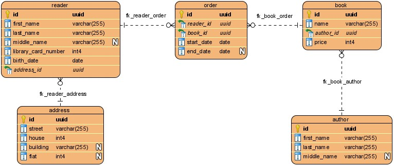

### Разворачивание бэкапа БД "demo"
Для работы с БД используется Docker (PostgreSQL разворачивается в Docker-контейнере). В [docker-compose.yml](../docker-compose.yml)
описаны инструкции разворачивания контейнера:
* `POSTGRES_DB: 'tpu-db-1'` - название БД, которая будет создана автоматически при инициализации контейнера.
* `POSTGRES_PASSWORD: 'postgres'` - пароль пользователя postgres.
* `- ./data:/var/lib/postgresql/data` - директория для хранения данных БД.
* `- ./setup:/docker-entrypoint-initdb.d` - директория со скриптом инициализации БД. Этот скрипт
([create_schema.sql](../setup/create_schema.sql)) создаёт пользователя и схему tpu_db.
* `- ./backup:/backup` - монтируем скрипт бэкапа БД в контейнер, чтобы в дальнейшем выполнить его в контейнере.

##### Подключение к PostgreSQL
Запущенный контейнер, подключение к нему через DBeaver (на скриншоте выделил логи контейнера по созданию БД, пользователя и схемы):
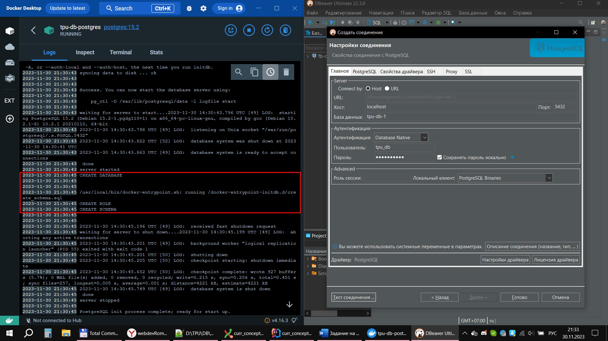

##### Создание БД
Как уже писал ранее, БД tpu-db-1 была создана автоматически, но вот пример создания БД в DBeaver:
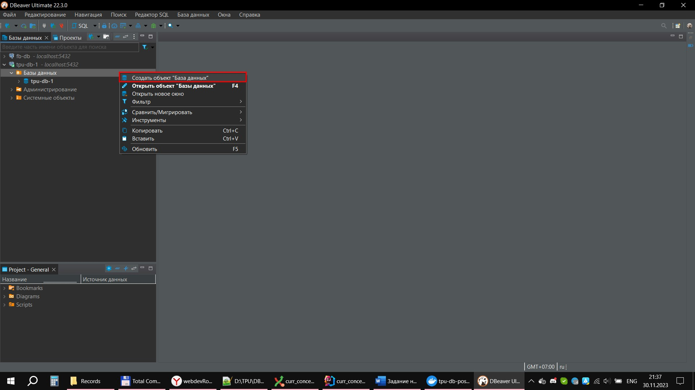
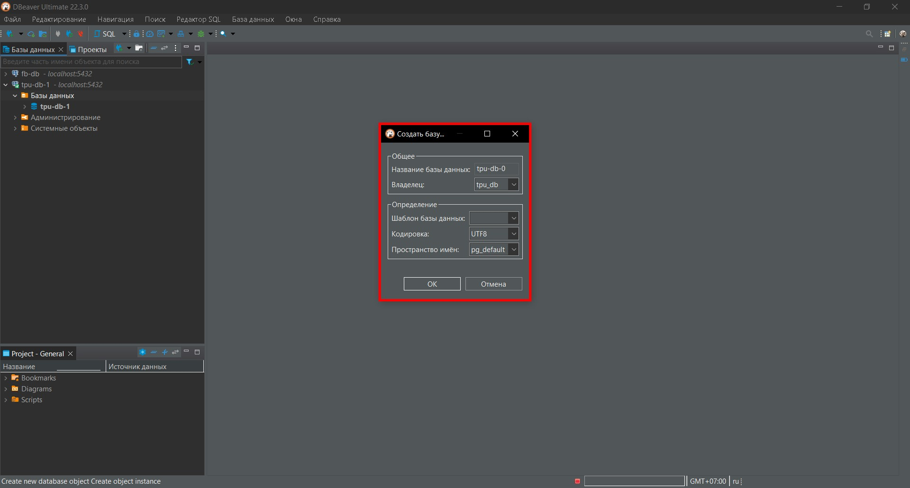

##### Разворачивание бэкапа БД

Скрипт бэкапа смонтирован в контейнер:
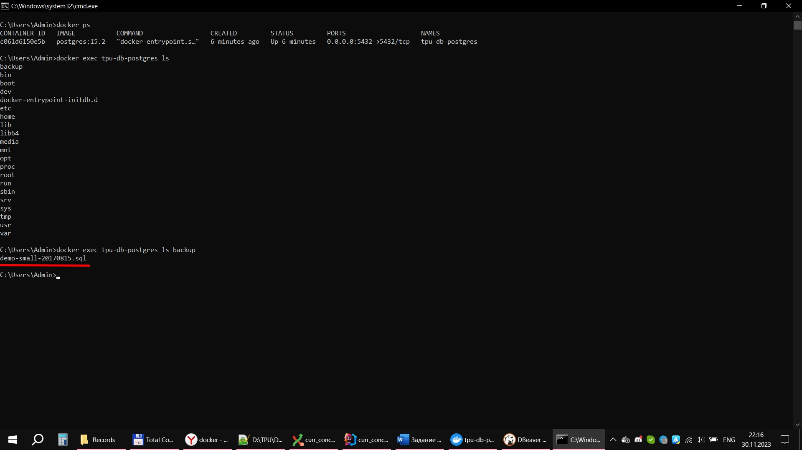

Выполнение скрипта бэкапа:
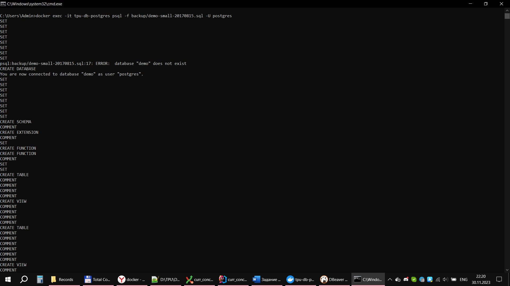
<...>
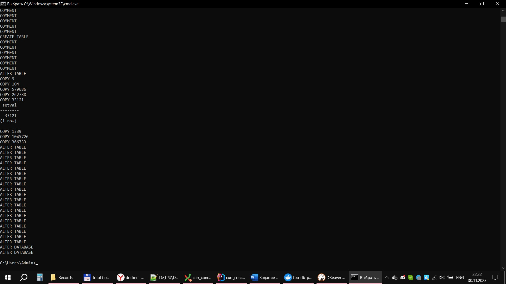

БД "demo" в списке всех БД:
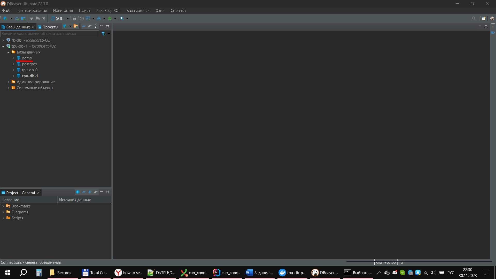

### Выполнение запросов
Открытие редактора SQL в DBeaver:
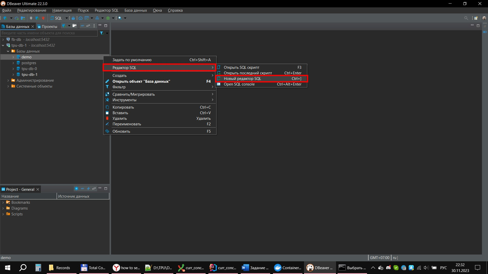

##### Задание
Вариант 4 
Выборка всех данных из таблицы «bookings» без указания столбцов. 
Выборка всех данных из таблицы «flights» по столбцам: flight_id, flight_no, scheduled_departure, scheduled_arrival,
departure_airport, arrival_airport. 
Создание любой таблицы.

##### Выборка всех данных из таблицы «bookings»
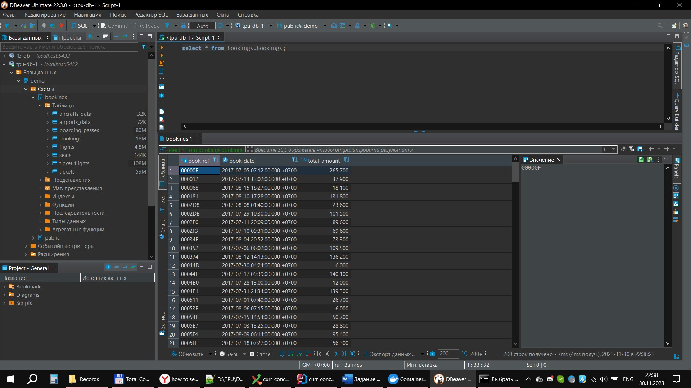

##### Выборка всех данных из таблицы «flights» по столбцам
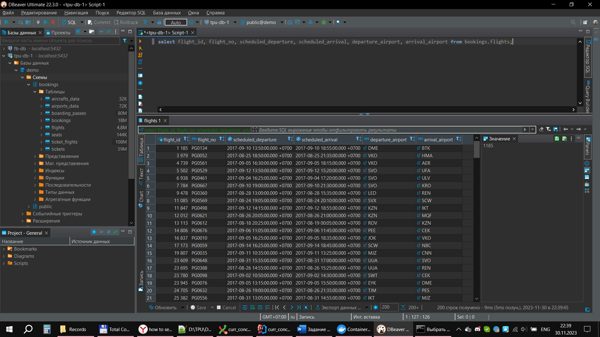

##### Создание любой таблицы
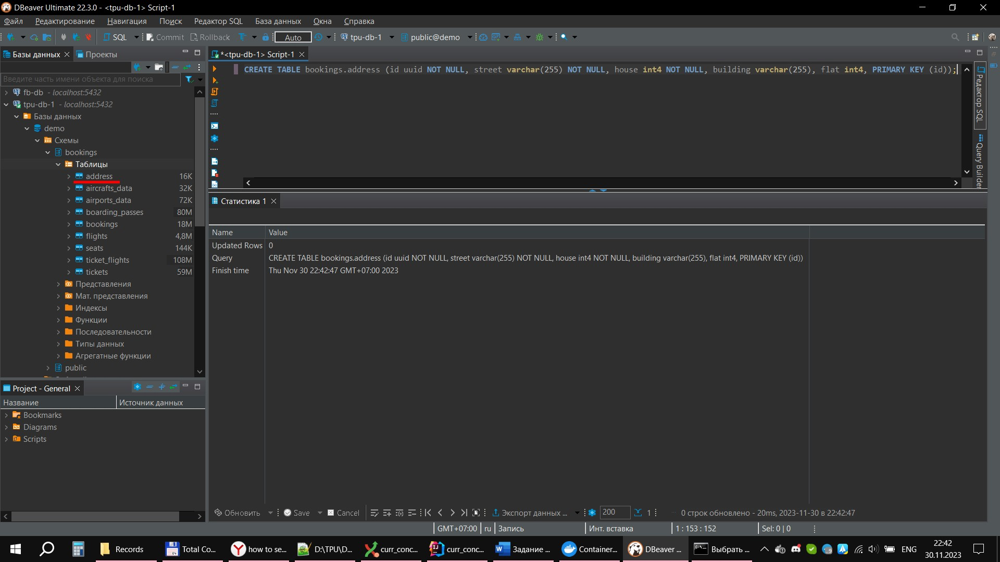