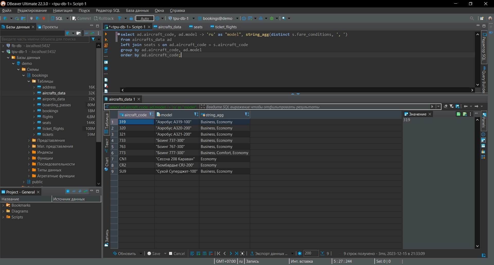
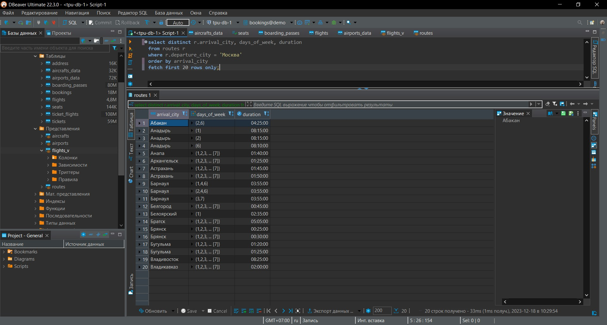
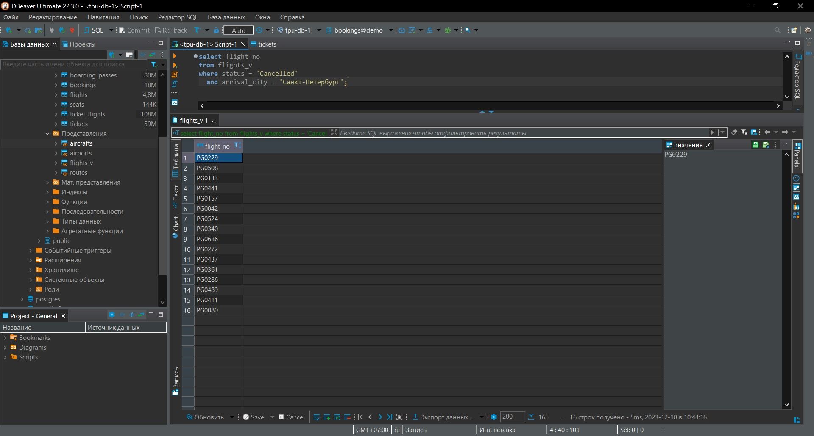
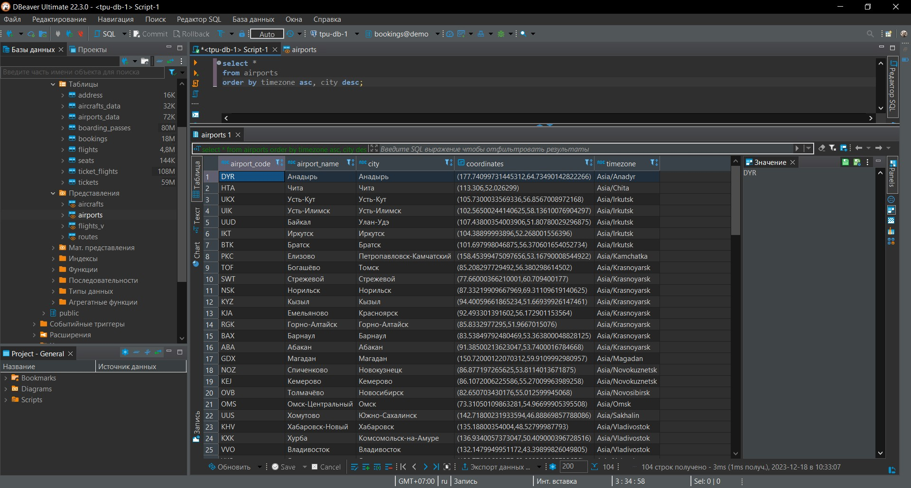
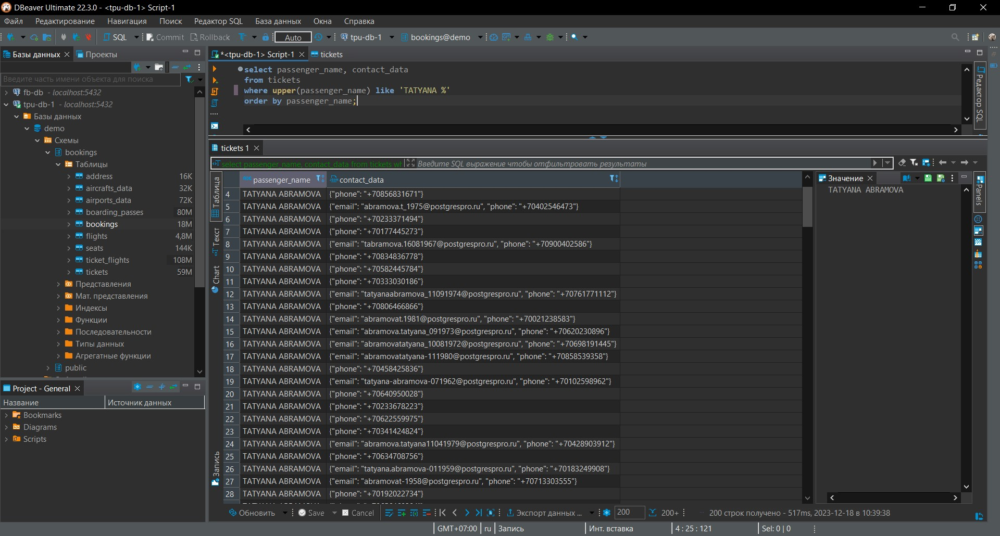

# Лабораторная работа №3

### Задание
Вариант 4.<br/>
Вывести:
* Классы обслуживания, присутствующие на различных воздушных судах
* Куда, в какие дни недели и за какое время можно долететь из Москвы (первые 20)
* Отмененные рейсы в Санкт-Петербург
* Аэропорты, по часовому поясу по алфавиту, по городу в обратном порядке
* Контактные данные пассажиров с именем «Татьяна»

##### Классы обслуживания, присутствующие на различных воздушных судах
Запрос:
```sql
select ad.aircraft_code, ad.model -> 'ru' as "model", string_agg(distinct s.fare_conditions, ', ')
from aircrafts_data ad
         left join seats s on ad.aircraft_code = s.aircraft_code
group by ad.aircraft_code, ad.model
order by ad.aircraft_code;
```


##### Куда, в какие дни недели и за какое время можно долететь из Москвы (первые 20)
Запрос:
```sql
select distinct r.arrival_city, days_of_week, duration
from routes r
where r.departure_city = 'Москва'
order by arrival_city
    fetch first 20 rows only;
```


##### Отмененные рейсы в Санкт-Петербург
Запрос:
```sql
select flight_no
from flights_v
where status = 'Cancelled'
  and arrival_city = 'Санкт-Петербург';
```


##### Аэропорты, по часовому поясу по алфавиту, по городу в обратном порядке
Запрос:
```sql
select *
from airports
order by timezone asc, city desc;
```


##### Контактные данные пассажиров с именем «Татьяна»
Запрос:
```sql
select passenger_name, contact_data
from tickets
where upper(passenger_name) like 'TATYANA %'
order by passenger_name;
```
