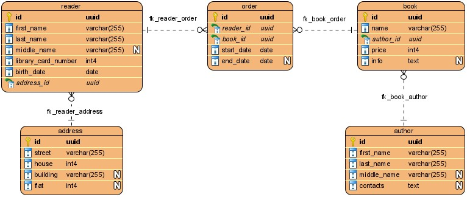
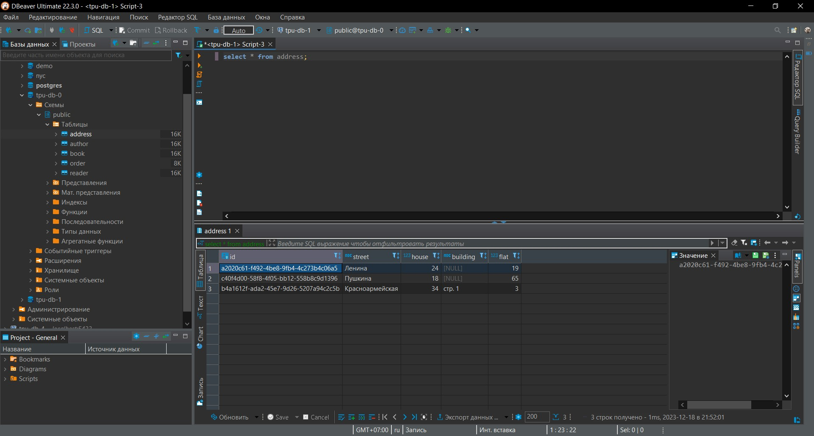
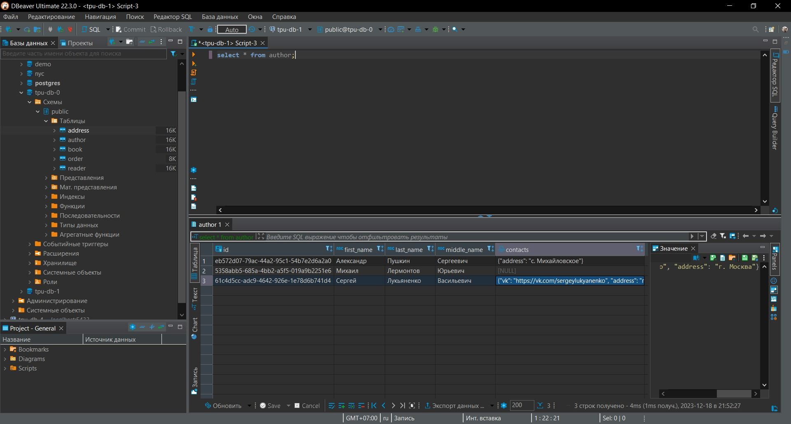
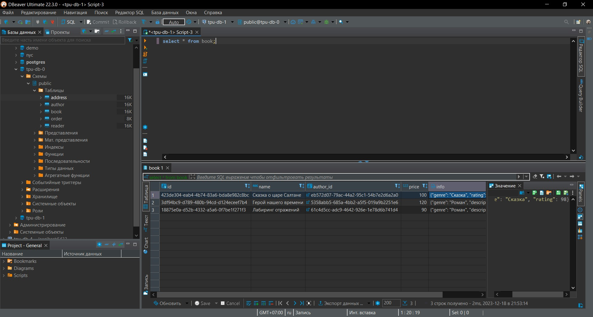
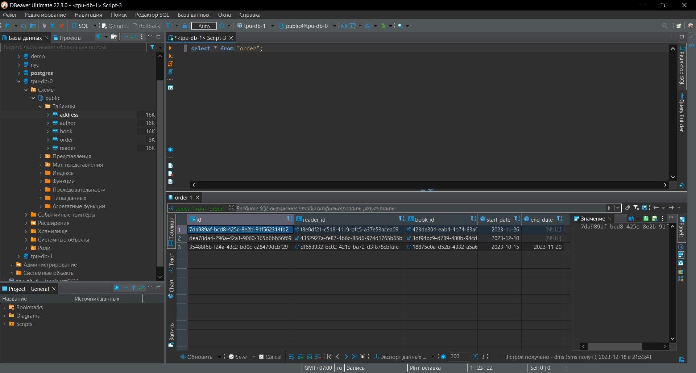
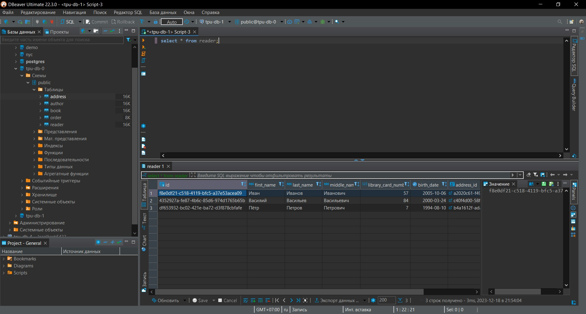
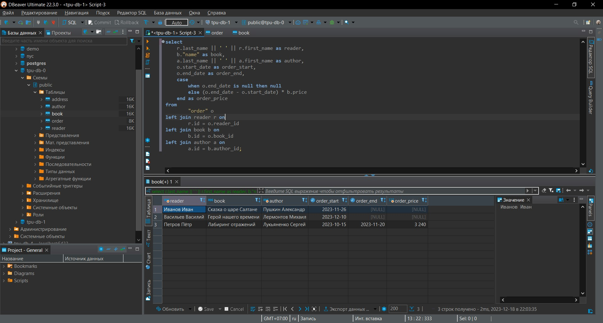

# Лабораторная работа №5

### DDL

Изменённая модель БД из лабораторной работы №2:



Добавлены атрибуты:

* `contacts` в сущности `author` - `contacts` можно рассматривать как отдельную сущность, т.к. её можно вынести в отдельную таблицу
* `info` в сущности `book` - в этом атрибуте можно хранить жанр книги, краткое описание, рецензии и т.д.

Новые атрибуты помечены типом `text`, но в самих атрибутах задан пользовательский тип данных `jsonb`, он подставится в DDL код при генерации.

Сгенерированный код SQL (генерация с помощью Visual Paradigm):

```sql
CREATE TABLE address
(
    id       uuid         NOT NULL,
    street   varchar(255) NOT NULL,
    house    int4         NOT NULL,
    building varchar(255),
    flat     int4,
    PRIMARY KEY (id)
);
COMMENT ON TABLE address IS 'Адрес';
COMMENT ON COLUMN address.id IS 'ID';
COMMENT ON COLUMN address.street IS 'Улица';
COMMENT ON COLUMN address.house IS 'Дом';
COMMENT ON COLUMN address.building IS 'Строение / корпус';
COMMENT ON COLUMN address.flat IS 'Квартира';
CREATE TABLE author
(
    id          uuid         NOT NULL,
    first_name  varchar(255) NOT NULL,
    last_name   varchar(255) NOT NULL,
    middle_name varchar(255),
    contacts    jsonb,
    PRIMARY KEY (id)
);
COMMENT ON TABLE author IS 'Автор книги';
COMMENT ON COLUMN author.first_name IS 'Имя';
COMMENT ON COLUMN author.last_name IS 'Фамилия';
COMMENT ON COLUMN author.middle_name IS 'Отчество';
COMMENT ON COLUMN author.contacts IS 'Контактная информация';
CREATE TABLE book
(
    id        uuid         NOT NULL,
    name      varchar(255) NOT NULL,
    author_id uuid         NOT NULL,
    price     int4         NOT NULL,
    info      jsonb,
    PRIMARY KEY (id)
);
COMMENT ON TABLE book IS 'Книга';
COMMENT ON COLUMN book.id IS 'ID';
COMMENT ON COLUMN book.name IS 'Название';
COMMENT ON COLUMN book.author_id IS 'ID автора';
COMMENT ON COLUMN book.price IS 'Цена аренды в день';
COMMENT ON COLUMN book.info IS 'Информация о книге';
CREATE TABLE "order"
(
    id         uuid NOT NULL,
    reader_id  uuid NOT NULL,
    book_id    uuid NOT NULL,
    start_date date NOT NULL,
    end_date   date,
    PRIMARY KEY (id)
);
COMMENT ON TABLE "order" IS 'Заказ';
COMMENT ON COLUMN "order".id IS 'ID';
COMMENT ON COLUMN "order".reader_id IS 'ID читателя';
COMMENT ON COLUMN "order".book_id IS 'ID книги';
COMMENT ON COLUMN "order".start_date IS 'Дата выдачи книги';
COMMENT ON COLUMN "order".end_date IS 'Дата возврата книги';
CREATE TABLE reader
(
    id                  uuid         NOT NULL,
    first_name          varchar(255) NOT NULL,
    last_name           varchar(255) NOT NULL,
    middle_name         varchar(255),
    library_card_number int4         NOT NULL,
    birth_date          date         NOT NULL,
    address_id          uuid         NOT NULL,
    PRIMARY KEY (id)
);
COMMENT ON TABLE reader IS 'Читатель';
COMMENT ON COLUMN reader.id IS 'ID';
COMMENT ON COLUMN reader.first_name IS 'Имя';
COMMENT ON COLUMN reader.last_name IS 'Фамилия';
COMMENT ON COLUMN reader.middle_name IS 'Отчество';
COMMENT ON COLUMN reader.library_card_number IS 'Номер читательского билета';
COMMENT ON COLUMN reader.birth_date IS 'Дата рождения';
COMMENT ON COLUMN reader.address_id IS 'ID адреса';
ALTER TABLE book
    ADD CONSTRAINT fk_book_author FOREIGN KEY (author_id) REFERENCES author (id);
ALTER TABLE "order"
    ADD CONSTRAINT fk_book_order FOREIGN KEY (book_id) REFERENCES book (id);
ALTER TABLE reader
    ADD CONSTRAINT fk_reader_address FOREIGN KEY (address_id) REFERENCES address (id);
ALTER TABLE "order"
    ADD CONSTRAINT fk_reader_order FOREIGN KEY (reader_id) REFERENCES reader (id);
```

### DML

Сгенерированный код для заполнения таблиц:

```sql
INSERT INTO address(id, street, house, building, flat)
VALUES (?, ?, ?, ?, ?);
INSERT INTO author(id, first_name, last_name, middle_name, contacts)
VALUES (?, ?, ?, ?, ?);
INSERT INTO book(id, name, author_id, price, info)
VALUES (?, ?, ?, ?, ?);
INSERT INTO reader(id, first_name, last_name, middle_name, library_card_number, birth_date, address_id)
VALUES (?, ?, ?, ?, ?, ?, ?);
INSERT INTO "order"(id, reader_id, book_id, start_date, end_date)
VALUES (?, ?, ?, ?, ?);
```

Пример заполнения таблиц:


### Запросы в заполненные таблицы











