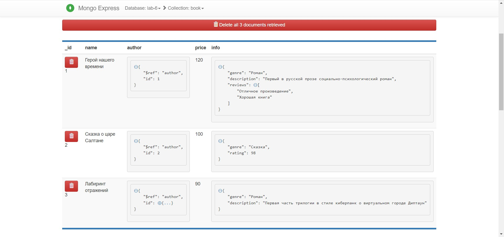

# Лабораторная работа №6

### Установка MongoDB

Для работы с MongoDB используется Docker (MongoDB разворачивается в Docker-контейнере). В [docker-compose.yml](../docker-compose.yml)
описан сервис `mongo` и инструкции разворачивания контейнера:

* `MONGO_INITDB_ROOT_USERNAME: root` - имя рутового пользователя.
* `MONGO_INITDB_ROOT_PASSWORD: pwd` - пароль рутового пользователя.
* `- ./data-mongo:/data/db` - директория для хранения данных БД.

Также в docker-compose описан сервис `mongo-express` - GUI для MongoDB, аналог Compass.

### Подключение к MongoDB

После запуска контейнеров `mongo` и `mongo-express`, по адресу `http://localhost:8081` будет доступен интерфейс `mongo-express`:

При входе нужно авторизоваться, логин/пароль по умолчанию: `admin`/`pass`.

Также можно подключиться к MongoDB через интерактивную консоль контейнера (в контейнере `mongo` установлен Mongo Shell):

### Выполнение запросов

##### Создание БД

##### Создание коллекции

##### Добавление документов в коллекцию

Добавление документа "Автор" с вложенным документом "Контактные данные автора":

Добавление нескольких документов с помощью Mongo Shell:

Добавление документов со ссылками и массивом:

Результаты добавления документов:

Выборка всех документов одной коллекции:

Выборки с фильтрацией:

Поиск одного документа + Выборка с пагинацией:

Создание и удаление индекса:

Обновление документа + Удаление документов:

Удаление коллекции:

